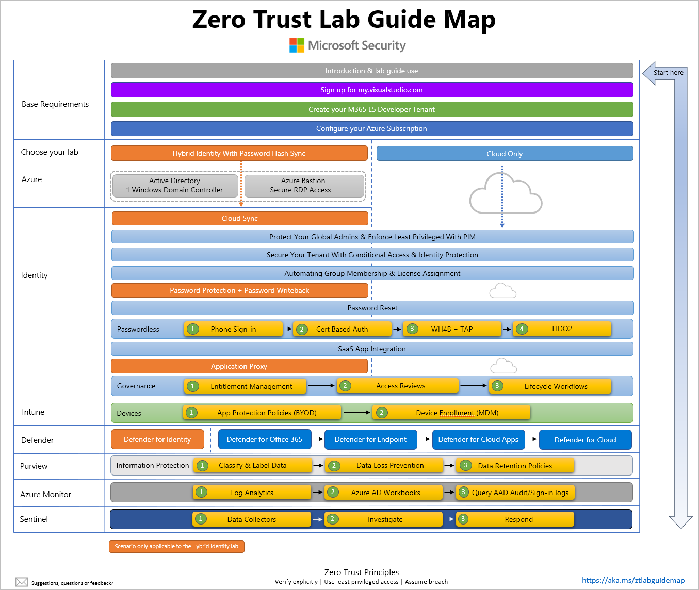

---
id: overview
title: 🖥️ Lab Guide Overview
sidebar_label: 🖥️ Overview
slug: /
---
# Zero Trust Lab Guide

Welcome to the Zero Trust lab guide. The purpose of this guide is to provide a Zero Trust learning path that provides logically ordered structured guidance on how to build your own lab. The lab is designed to be simple, usable, and demo rich. Once built it requires minimal ongoing maintenance for longevity. Say goodbye to expiring trials and time-consuming lab rebuilds.

The guide has been created with the aim to retain knowledge by building something from the ground up using your own environment. This approach provides an opportunity to fail occasionally (that’s good), learn to troubleshoot, and explore along the way, and by following this guide it will help you understand (and talk to) the end-to-end Zero Trust story to better grasp how all of the features and services within the Microsoft 365 stack fit together to tell the Microsoft Security Zero Trust story. 

Microsoft 365 is the integration of multiple products that are themselves challenging to understand and deploy both in the enterprise, and in our own labs. This guide aims to remove the ambiguity, self-doubt, and frustration of building a lab by attempting to solve these common stumbling blocks.

- Where do I start?
- How complicated should my lab be?
- How do I know the correct path and order to take?
- How do I know when I’m done with a part of the deployment and that I did it right?

The lab guide is modular and structured in scenario-based phases that provides the reader with a choice of doing either a Hybrid (aka On-Premises AD) or Cloud Only deployment, with clearly articulated exit criteria for each phase and step. Complexity of the Hybrid option goes no deeper than enabling Password Hash Sync to avoid ADFS and hence any public domain name and certificate requirements. By following this guide the aim is to obtain a level 200 understanding of the following products across Microsoft 365 and Azure which you will configure and setup along the way.

- Microsoft Entra ID (P1/P2)
- Azure Virtual Machines
- Azure Bastion
- Azure Policy
- Microsoft Security Benchmark
- Microsoft Intune
- Microsoft Purview
- Microsoft Sentinel 
- Defender for Identity
- Defender for Endpoint
- Defender for Office 365
- Defender for Cloud Apps 

## Current lab challenges

We all have our own Microsoft Entra tenants that we use for testing, demoing, and learning, and these require yearly extension requests to ensure that the licenses do not expire. To use Microsoft 365 properly you really need your Microsoft Entra tenant linked with an Azure subscription. Our Microsoft FTE provided Azure Internal Subscriptions (AIRS) are all tied to the microsoft.com tenant, which means the below limitations when using them for lab purposes: 

- You cannot link your subscription to your own Microsoft Entra tenant 
- You are unable to evaluate any Microsoft 365, Microsoft Entra, MCAS, Intune, or other security related features in the Defender stack.
- You cannot enable any Sentinel features, or data source integrations with your own Microsoft Entra, Microsoft 365, Defender, etc. 
- You cannot use Azure Virtual Desktop
- Strict Microsoft policies automatically apply to your Virtual Machines & Virtual Networks preventing certain configuration options, such as opening ports to the internet.

## The solution

To overcome these limitations (and provide longevity and usefulness for your lab) this guide will instead utilise a Visual Studio Enterprise benefit as the basis for building a lab environment as it includes an Azure subscription with $150 USD monthly credit which will allow the use of key features such as Log Analytics and Logic Apps with a tenant. Through this benefit automatic membership to the [Microsoft 365 Developer Program](https://learn.microsoft.com/office/developer-program/microsoft-365-developer-program-faq) is provided, which provides a Microsoft 365 E5 Developer tenant that comes pre-provisioned with hydrated content for Microsoft Teams, SharePoint, Outlook, and includes 25 Microsoft 365 E5 licenses, which simulates a small corporate environment. Most importantly though is that this tenant does not expire, it automatically extends itself every 3 months if logged into it periodically. 👍

## Lab Guide Map

The lab guide map provides a visual representation of how to deploy the lab depending on your choice of *Hybrid* or *Cloud Only* and a hyperlinked version that will take you straight to each step or feature in the guide is available at [https://aka.ms/ztlabguidemap](./assets/ztlabguidemap.pdf)

