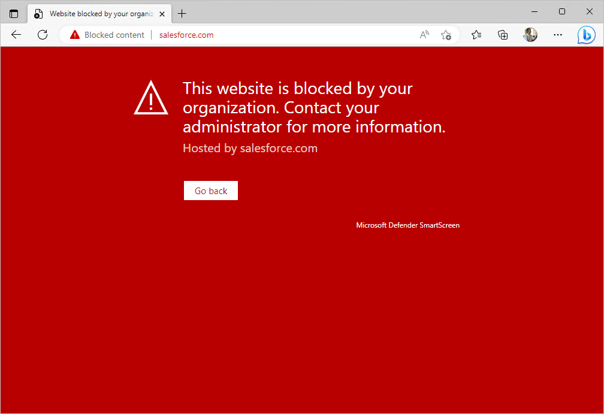

---
id: defcloudapp
title: Defender for Cloud Apps 
sidebar_label: Defender for Cloud Apps
slug: /defcloudapp
---

Defender for Cloud Apps is a cloud access security broker (CASB). CASBs serve as a gatekeeper to broker access in real time between your users and the cloud resources they use, wherever your users are located and regardless of the device they are using. Defender for Cloud Apps natively integrates with other Microsoft security capabilities, including Microsoft 365 Defender, Microsoft Entra Conditional Access, and Sentinel. Without Defender for Cloud Apps, cloud apps being used in an organization are considered unmanaged and unprotected. 

Defender for Cloud Apps can discover what apps are being used by collecting data from firewalls and proxies, as well as from clients via Defender for Endpoint.

Discovered apps can then be added to Defender for Cloud Apps and tagged as either *sanctioned* or *unsanctioned*. Serving as a reverse proxy, it proxies access to sanctioned cloud apps and blocks access to unsanctioned ones. With Conditional Access, Defender for Cloud Apps can also apply session controls to sanctioned apps by restricting the ability to print, copy/paste, or download a file when using the cloud app.

Defender for Cloud Apps also provides out-of-the-box threat detection policies for app usage that are enabled by default. After an initial learning period, it will start alerting you when suspicious actions are detected, such as activity from anonymous IP addresses, suspicious inbox forwarding configurations, ransomware activity, and more.

## Lab success exit criteria.

Protecting your tenant against malware infections and data being left unencrypted on personal devices means that you need to ensure that your data is only available on devices that meet minimum security configurations. In this lab we will perform the necessary configurations for limiting file downloads from Microsoft 365 apps to managed devices only via Microsoft Defender for Cloud Apps.

Using our existing Windows 11 Microsoft Entra joined virtual machine that is now both Intune managed and Defender for Endpoint controlled, we will discover what cloud apps are being used from this device via the Defender for Cloud Apps integration with Defender for Endpoint. We will then tag an application as unsanctioned to block access to it. Using a session policy, we will then allow access to another app, but restrict the ability to download sensitive documents from it onto the device.

## Prerequisites 

You need to have these items prepared for this lab.

## Estimated lab completion time.

30 minutes

## Step 1. Enable Defender for Endpoint integration.

The Defender for Cloud Apps integration with Defender for Endpoint provides a seamless Shadow IT visibility and control solution. This native integration enables Defender for Cloud App administrators to easily investigate discovered devices, network events, and app usage. 

To enable Defender for Endpoint integration with Defender for Cloud Apps:

1. In the **M365 Defender portal** <https://security.microsoft.com>, from the navigation pane, select **Settings** > **Endpoints**.
1. Under **General**, select **Advanced features**.
1. Toggle the **Microsoft Defender for Cloud Apps** to **On** and then select **Save preferences**.

   

1. Select the **Settings** icon again at the bottom of the left-hand navigation pane and then select **Cloud Apps > Cloud Discovery > Microsoft Defender for Endpoint.**

1. Check the box for **Enforce app access** and then click **Save.**
1. It can take a few minutes for data to flow into Cloud Discovery from Defender for Endpoint.

   

This setting will allow you to block access to any app that you classify as unsanctioned.

1. Return to the lef-hand navigation pane and click **Settings** > **Endpoints** > **Advanced features**, and then select **Custom network indicators** to **On** and click **Save.**

   

This allows you to leverage Microsoft Defender Antivirus network protection capabilities to block access to a predefined set of URLs using Defender for Cloud Apps.

## Step 2. Generate app activity from the client virtual machine.

1. Log into your virtual machine as a test user that you have been using throughout the guide (e.g. Bobby Smith) and then open a browser and log into <https://myapps.microsoft.com> and then click some of the M365 apps in the list to access them, such as OneDrive, Outlook, & Teams.
1. Now navigate to <https://login.salesforce.com> and let the page load and then close the window. We are not logging into Salesforce here, but rather generating some traffic to Salesforce so Defender for Cloud Apps detects it as an app that is being used by the user.

## Step 3. View discovered apps in the Cloud Discovery dashboard.

Now that Defender for Endpoint is integrated with Defender for Cloud Apps and we have generated some app activity from the client we can now view the discovered device data in the Cloud Discovery dashboard.  
***Note:*** It can take 10 minutes or more before data will start to show up in the Cloud Discovery dashboard for the device.

1. In the M365 Defender portal, go to **Cloud Apps > Cloud Discovery**

1. In this dashboard you should see it now populated with data pertaining to discovered apps, resources, devices, users etc.

   

1. Click on the **Discovered apps** tab at the top of the dashboard.

1. Find the Salesforce app and then tag it as *unsanctioned* under the **Action** column by hitting the block icon and then click **Save** when prompted at the “Tag as unsanctioned” confirmation pop-up.

   

1. Salesforce should now appear as Unsanctioned.

   

Apps marked as **Unsanctioned** in Defender for Cloud Apps are automatically synced to Defender for Endpoint. More specifically, the domains used by these unsanctioned apps are propagated to devices to be blocked by Microsoft Defender Antivirus.

***Note:*** The time latency to block an app via Defender for Endpoint is up to three hours from the moment you mark the app as unsanctioned in Defender for Cloud Apps to the moment the app is blocked on the device.

## Step 4. Test accessing Salesforce from the client machine

1. Return back to your client virtual machine and try to acess https://salesforce.com again.
1. You should be blocked from accessing SalesForce and presented with this message.

   

This completes the **Defender for Cloud Apps** lab.
